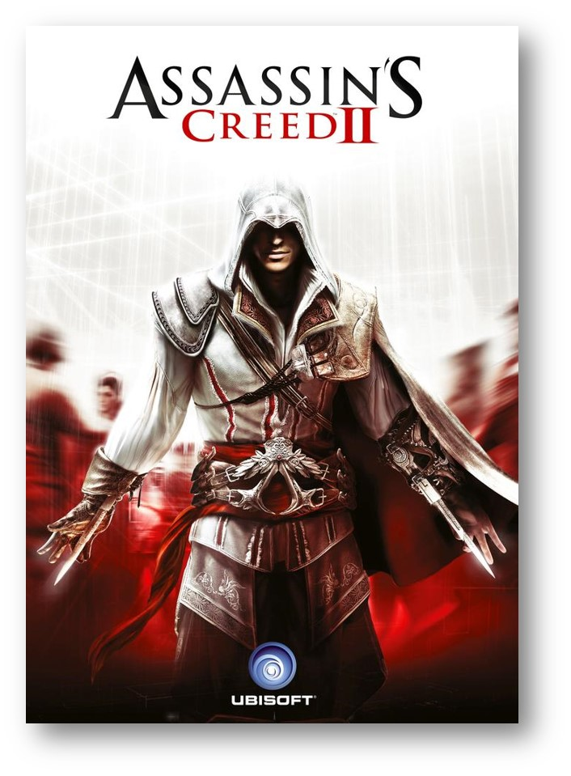

I am [Clara Ratera](https://www.linkedin.com/in/clara-ratera-graci%C3%A0-265077129/), student of the [Bachelor’s Degree in Video Games by UPC at CITM](https://www.citm.upc.edu/ing/estudis/graus-videojocs/). This content is generated for the second year’s subject Project 2, under supervision of lecturer [Ricard Pillosu](https://es.linkedin.com/in/ricardpillosu).

## GAME PILLARS

### What are game pillars?

Game pillars, as the name states, are one of the main support structures of a game. They are the key elements that define the game internally during development. They should be detailed at the beginning of the design process to be able to go back to them any time a new mechanic or feature idea comes up. They are the standard in the industry, predominant in big teams as they help keep everyone on the team on the same page. 

It is important to note that they define the game only internally. They can often be confused with unique selling points (USP), as these also define the game, but these do it externally. USP cater to the market, from investors to consumers, and some elements that would be critical as a Game Pillar might halter the progress as a USP. One such example is Accessibility, it is crucial for the team to work around that concept, but when exposing the game to the public you might want to replace that word as the consumer tends  to adhere a bad connotation to it, be it "easy" or "boring", while internally this might mean creating a certain difficulty curve or different difficulty options. 

More so, they are not a simple list of desired features, they are guidelines upon which the following design decisions should base themselves. They should work as an idea filter and be a great help keeping feature creep away from the project while keeping the good ideas related to the project ideals and needs producing a coherent and cohesive game. 

With all this they do not completely limit a game's extra mechanics but if they go against those pillars, they most likely shouldn't be implemented. As we all know, game design needs to be flexible and change over time but you should have a solid reason why you would change or ignore one of those pillars that help keep your game together.

The development process should be centered on those pillars and polishing their main features, extra elements should not take its spotlight. 

### Some examples

In The Last of Us there are 4 clear pillars that the game follows:

* Crafting: from ammo, medkits to weapon upgrades. 
* Stealth: combat is allowed but the game makes it hard to keep a combat-only approach.
* Story: as a linear game it is highly story driven.
* AI partners: one of the game's focus is the relationship that the player develops with their AI partner. 

As a huge production combining teams from different countries it was especially important to set game pillars for Assassin's Creed II: 

* Fight: many new features were added from its predecesor, new enemies, new weapons and new moves.
* Navigation: or parkour, one of the biggest identyfiers of an AC game, it needed to be fluid so the player could focus on where he was going. 
* Social stealth: mixing with the crowds to hide from enemies and enter restricted areas. 

As I've previously said, nothing in game design is set in stone, it is important to acknowledge the different ways in which things can be done. [This talk from GDC 2017](https://youtu.be/kzQDVtysXjA) proves how you can pay very little attention to what I've just said and still manage to get a good game. Keep in mind that setting a structure early on and sticking to it, with a certain degree of freedom, is the most important thing to keep your development coherent. 

### Bibliography:

[ThursDEV](https://www.youtube.com/watch?v=_EtxKlctpXw)

[GDC 2010 ACII](https://www.youtube.com/watch?v=Pmlk3ZZ6jl0)

[Gamasutra](https://www.gamasutra.com/blogs/MaxPears/20171012/307469/Design_Pillars__The_Core_of_Your_Game.php)

[Technical Game Design](http://technicalgamedesign.blogspot.com.es/2011/04/pillars.html)
